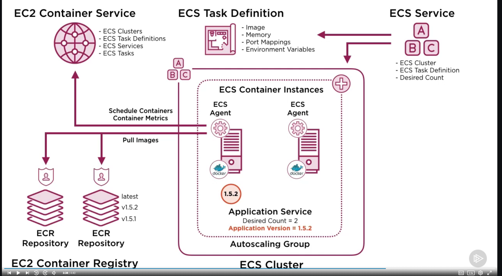
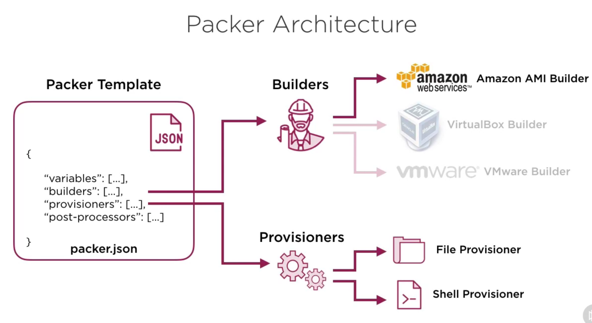

# AWS With Docker

## IAM Best Practices

* TWO factor authentications
* Assign privilegies to IAM roles, then IAM roles to groups
  * IAM role includes policies to allows access to AWS resources
  * This allows temporary user elevations access

* Create account alias
  * IAM > customize > create alias (allan-alias)
* Create IAM role (admin)
  * Another Account > Account ID - flag MFA > AdministratorAccess

### IAM Assume Roles

This guide creates a Admin Role to assume a cross-account access based on root user.
A Admin group with will be created with an inline policy the allows to assume the Admin Role via Switch Tole
A User group with inline policy that assures every user must use MFA authentication will be created

1. Create an Admin Role with **AdministratorAccess** policy
2. Copy/save the Role ARN
3. Create an Admin Group with the below Inline Policy

```json
  {
      "Version": "2012-10-17",
      "Statement": [
          {
              "Sid": "AssumeAdminRole",
              "Effect": "Allow",
              "Action": "sts:AssumeRole",
              "Resource": ["ARN ROLE CREATED"]
          }
      ]
  }
  ```

1. Create a User group with the Inline Policy described in this [link](https://gist.githubusercontent.com/mixja/15d2969efe806680c2a4b0059daaf697/raw/a88806a69d35d1595ce9e2b196677607ac40b84f/security.json), or in the file [./security.json](./security.json)
2. Pay attention to replace all the place holder regarding *PASTE_ACCOUNT_NUMBER* with the root user account id
3. Create a new user ans attach it to both groups created before
4. Log In and go to the user profile and set up MFA
5. Log in again and switch roles.

### AWS Local Config for new Admin with role

* ./aws/credential

``` bash
[allan-aws-free]
aws_access_key_id = 'Generate in User/Security Credentials/Create access key'
aws_secret_access_key = 'Generate in User/Security Credentials/Create access key'
```

* ./aws/config

``` bash
[profile allan-aws-free-admin]
source_profile = allan-aws-free
role_arn = 'ARN ROLE CREATED'
mfa_serial = 'Get in User/Security Credentials/Assigned MFA device'
region = eu-central-1
output = json
```

* set the profile `export AWS_PROFILE=allan-aws-free-admin`
* test the connection `aws ec2 describe-vpcs`

## AWS CLI

* pip install awscli
* AWS console > IAM > User > Create access key
* Add to .bash, .zshrc or etc: `export PATH=~/.local/bin:$PATH`
* `source ~/.zshrc`
* `aws configure`
* Test access: `aws ec2 describe-vpcs`

### CLI Tips

* Apply a role manually: `aws sts assume-role --role-arn arn:aws:iam::103162649456:role/Admin --role-session-name allan.weber`
* Unset variables: `unset AWS_ACCESS_KEY_ID AWS_SECRET_ACCESS_KEY AWS_SESSION_TOKEN`

## ECS



* Create new ECR repository: [https://eu-central-1.console.aws.amazon.com/ecr/repositories?region=eu-central-1](https://eu-central-1.console.aws.amazon.com/ecr/repositories?region=eu-central-1)
* Create new Repository
* `eval $(aws ecr get-login --no-include-email)`
* Click **View push commands** to see build tag and push commands
* **For microtrader project run**:
  * `make test`
  * `make tag:default`
  * `make publish`

### ECS Cluster

* Create a cluster filling the fields
* Select to create a new Security Group allowing SSH port 22 from anywhere

#### Log in into the cluster instance

* Copy the ec2 instance IPV4 public ip address
* `sudo chmod 400 ~/.ssh/allan-admin.pem`
* On WSL copy the .pem from windows .ssh to `\\wsl$\Ubuntu-20.04\home\USER\.ssh`
* `ssh -i ~/.ssh/allan-admin.pem ec2-user@ec2-3-68-114-38.eu-central-1.compute.amazonaws.com`
* `docker ps`
* `sudo yum install jq -y`
* `docker inspect -f '{{json .HostConfig.Binds}}' ecs-agent | j`
* Cluster logs: `ls -l /var/log/ecs`
* See logs: `cat /var/log/ecs/ecs-agent.log`
* Get cluster info: `curl -s localhost:51678/v1/metadata | jq`
* Show ECS services or tasks: `curl -s localhost:51678/v1/tasks | jq`

#### ECS Task

* Wizard is easy just add the repo of the image, set tasks counts to define the number of running containers and env variables

### Customize ECS Container Instances

* Use [Packer](https://learn.hashicorp.com/tutorials/packer/get-started-install-cli) to create custom AMI



* The packer template is in a new repo and is called packer-ecs
* Check the most recent ECS AMI image [https://docs.aws.amazon.com/AmazonECS/latest/developerguide/ecs-optimized_AMI.html](https://docs.aws.amazon.com/AmazonECS/latest/developerguide/ecs-optimized_AMI.html)
* For eu-central-1 is: ami-0b440d17bfb7989dc

## OLDER Prerequisites Packages

`pip3 install ansible`

`pip3 install boto3 netaddr`

`sudo -H easy_install pip`

`sudo -H /usr/bin/python -m pip install boto3 --ignore-installed six`

`brew unlink python`

`brew link --overwrite python`

## Other Recommended Tools

`brew install tree`

## Source Repository

[https://github.com/docker-production-aws](https://github.com/docker-production-aws)

## Frameworks

[https://vertx.io/docs/#microservices](https://vertx.io/docs/#microservices)

[App Sample - http://escoffier.me/vertx-hol/](http://escoffier.me/vertx-hol/)

## Projects

[Microtrader](https://github.com/allanweber/microtrader)

[Microtrader-base](https://github.com/allanweber/microtrader-base)
